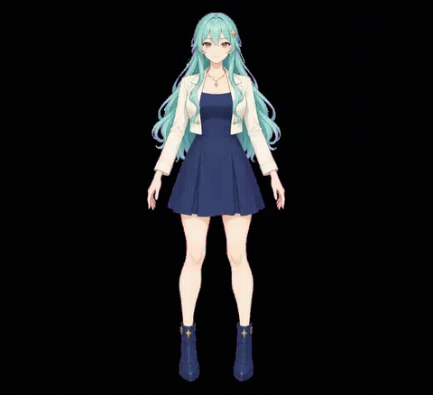

# StandRig Image Lab

## 현재 개발 상태

최신 작업은 **`feat/part-guide-local-audio`** 브랜치와 [PR #1](https://github.com/ast2r2sk-coder/StandRig-ImageLab/pull/1)에 있습니다. `image-lab` 기본 브랜치에는 아직 병합하지 않았습니다. README의 GIF는 이전 버전이며 새 음성 팩 기능의 시연은 아닙니다.

- 음성/TTS 재생 중에도 눈깜빡임과 작은 움직임이 함께 동작합니다. 포즈를 다시 누르면 재시작하고 종료 후 이전 자세로 복원하며 음성을 끊지 않습니다.
- 자동 움직임은 얼굴·몸을 휘는 대신 전체 그림을 작게 이동·회전합니다. 머리카락 스프링은 분리해 작게 제한했습니다. 수동 각도·포인터에는 기존 변형이 남습니다.
- 로컬 한국어 음성 팩은 실제 WAV와 모델이 추정한 자모 타이밍으로 E/A/O를 자동 전환합니다. **I 계열은 E 그림으로 대체**하며 정확한 음소 경계는 아닙니다.
- 현재 사용 흐름은 **로컬 CLI로 생성 → 음성 팩 가져오기 → 재생**입니다. 앱 안에서 대사 입력부터 생성까지 한 번에 연결한 기능은 아직 없습니다. 기존 브라우저 TTS는 별도의 이벤트 기반 근사입니다.
- 머리 단독 끄덕임, 자연스러운 머리카락 완성, 전용 I 그림, 큰 각도 복원은 남아 있습니다. 인사는 전체 캐릭터 기울임이며 손 흔들기가 아닙니다.
- 새 문장 10개 중 10개, 대조군 포함 12개 중 11개가 정렬 기준을 통과했습니다. 원래 긴 인사말 하나는 거부됐습니다. 실제 브라우저 음성 팩 검사는 13개 통과했지만 모든 대사의 발음 정확도나 자연스러움을 보장하지 않습니다.

### 로컬 음성 팩 사용

macOS의 Yuna 음성, Python 3.11과 별도 로컬 모델이 필요합니다. 최초 의존성·모델 설치에는 인터넷이 필요하며 대사 합성·분석은 로컬에서 처리합니다. 모델과 가상환경은 저장소에 포함하지 않습니다.

[설치·모델 출처·실행 명령·테스트·권리 안내](docs/LOCAL-SPEECH.md)를 확인하세요. 생성한 `utterance.speech.json`을 앱의 **오프라인 speech pack**에서 선택한 뒤 **팩 재생**을 누릅니다. 팩은 최대 5MiB·30초이며 대사와 음성을 포함하므로 공유에 주의하세요. 실패한 대사는 성공 팩을 만들지 않고, 배치 일부 실패 시 성공 결과는 보존하면서 실패 종료코드를 반환합니다.


### 그림은 있어요. 이제 움직임을 시험해 보세요.

**[English](README.md) · [상세 사용법](README-IMAGE-LAB.md) · [기여하기](https://github.com/ast2r2sk-coder/StandRig-ImageLab/issues)**



캐릭터 그림은 있지만 파츠가 나뉜 PSD는 없을 때, PNG/JPG로 간단한 리깅을 시험하는 도구입니다. [StandRig](https://github.com/sayaka-aiart/StandRig)의 엔진에 이미지 입력과 마스크 편집, 샘플 표정, 오프라인 HTML 생성을 추가했습니다.

**자동으로 완성형 Live2D를 만들어 주는 도구는 아닙니다.** 직접 파츠 영역을 조정하는 실험판이며, 작은 움직임과 표정부터 시험하는 데 초점을 맞춥니다.

## 무엇을 할 수 있나요?

- PNG/JPG를 불러오고 폴리곤 마스크와 색상 키로 파츠 영역을 편집합니다.
- 샘플의 좌우 눈을 따로 제어하고, 실제 그림으로 반닫힘·닫힘 표정을 만듭니다.
- A/E/O 입 모양과 입 열기를 따로 조절합니다.
- 머리와 몸의 움직임, 머리카락 스프링을 시험합니다.
- 역할별 프롬프트로 파츠를 준비하고 가져온 뒤 마스크·레이어 순서·이동·배율을 조정합니다. 파츠 가져오기와 원본 복원은 기존 배치를 초기화합니다. 프로젝트 JSON으로 저장해 다시 편집합니다.
- 로컬 오디오 파일은 RMS 진폭으로 입을 엽니다. TTS는 브라우저가 로컬로 표시한 음성만 사용하며 입 동작은 이벤트 기반 근사로 RMS·음소 정렬이 아닙니다. 로컬 음성이 없으면 오류와 파일 재생 대안을 표시합니다. 마이크는 미지원이며 오디오는 프로젝트에 저장되지 않습니다.
- 작은 인사·끄덕임·갸웃 포즈를 재생한 뒤 이전 각도로 복원합니다. 손 흔들기나 큰 동작은 아닙니다.
- 이미지가 포함된 StandRig JSON을 내보내거나 단일 HTML 실행 파일을 만듭니다.

편집기는 작업 이미지를 자동 업로드하지 않으며 이미지 생성 API 키가 필요하지 않습니다. 저장한 파일에는 이미지가 포함될 수 있으므로 공유 전에 확인하세요.

## 시작하기

Node.js 22 또는 24, npm, 데스크톱 브라우저를 준비하세요. 샘플은 Chrome에서 실행을 확인했습니다.

```bash
git clone --branch feat/part-guide-local-audio https://github.com/ast2r2sk-coder/StandRig-ImageLab.git
cd StandRig-ImageLab
npm ci
npm run build
npm run dev
```

**http://127.0.0.1:5181/image-lab.html**을 엽니다.

1. **재생**을 누르면 샘플이 움직이며 눈을 깜빡입니다.
2. **얼굴 확대**를 누르고 눈·입 슬라이더를 조절해 보세요.
3. **원본 교체**로 다른 그림을 불러오세요. 그림에 맞춰 마스크를 조정해야 합니다.
4. 종료하거나 새로고침하기 전에 **편집 프로젝트 JSON**을 저장하세요.

Image Lab에는 StandRig 백엔드 서버가 필요하지 않습니다. 원래 PSD/MCP 기능은 [원 프로젝트 안내](https://github.com/sayaka-aiart/StandRig#readme)를 참고하세요.

### HTML 한 파일로 실행하기

빌드 후 다음 명령을 실행하세요.

```bash
node scripts/package-image-lab.mjs
```

`workspace/delivery/Image-Lab.html`을 Chrome에서 열면 됩니다. 생성에는 개발 환경이 필요하지만, 생성된 파일을 열 때는 서버나 Node.js가 필요하지 않습니다.

배포 시 `LICENSE`, `NOTICE`, `THIRD_PARTY_NOTICES.md`, `licenses/`와 [캐릭터 고지](assets/character/NOTICE.md)를 함께 제공하세요. 패키저는 고지 파일을 자동으로 동봉하지 않습니다. 편집 자료가 섞일 수 있는 `workspace/` 전체를 공개하지 마세요.

## 현재 한계

큰 각도에서 얼굴이 자연스럽게 돌아가는 기능은 아직 해결하지 못했습니다. 현재는 2D 그림의 변형이며, 가려진 면을 복원하는 3D 모델이 아닙니다.

- 머리·몸의 가려진 부분 소재는 보관되어 있지만 실제 모델에는 적용하지 않았습니다.
- 눈·입 전환 중 잔상과 피부 경계, 머리카락 외곽의 마젠타 잔색이 보일 수 있습니다.
- 새 원화로 바꾸면 샘플 전용 표정이 비활성화됩니다. 새 캐릭터에는 별도의 표정 정렬 작업이 필요합니다.
- Cubism `.moc3`/`.cmo3`, 카메라 얼굴 추적, 마이크·음소 정렬은 지원하지 않습니다. TTS는 로컬 음성만 지원하며 원격 음성으로 대체하지 않습니다.
- 모바일 파일 열기와 내보내기는 추가 검증이 필요합니다.

## 함께 개선하고 싶다면

각도별 얼굴 소재 정렬, 실제 프레임 성능, 표정 경계 보정, 영문 UI, 재사용 권리가 명확한 샘플을 특히 환영합니다. 모두 앞으로 개선할 대상이며 현재 지원 기능이 아닙니다.

```bash
npm run build
npm test
```

움직임을 바꿨다면 같은 그림과 화면 크기로 전후 영상을 남겨 주세요. 정지 화면이나 테스트 통과만으로 자연스러운 움직임을 판단하지 않습니다. 버그는 브라우저·운영체제·재현 순서와 함께 [Issues](https://github.com/ast2r2sk-coder/StandRig-ImageLab/issues)에 알려 주세요. PR 대상은 이 포크의 **`image-lab`** 브랜치입니다.

이 방향의 도구가 필요했다면 **스타로 저장해 주세요.** 재현 가능한 버그 제보와 작은 수정도 큰 도움이 됩니다.

## 원 프로젝트와 라이선스

모델링 코어, 런타임, 메시 변형, 물리 연산과 기본 문서 형식은 **[sayaka-aiart/StandRig](https://github.com/sayaka-aiart/StandRig)**에서 가져왔습니다. Image Lab은 공식 StandRig 배포판이나 Live2D Cubism의 대체품이 아닙니다.

코드는 [Apache-2.0](LICENSE)이며 원본 및 서드파티 고지를 유지합니다. 샘플 아트는 제공자의 허락으로 포함했지만, **코드 라이선스가 아트의 상업 이용·재배포 권한을 자동으로 부여하지 않습니다.** [캐릭터 고지](assets/character/NOTICE.md)를 확인하세요.
